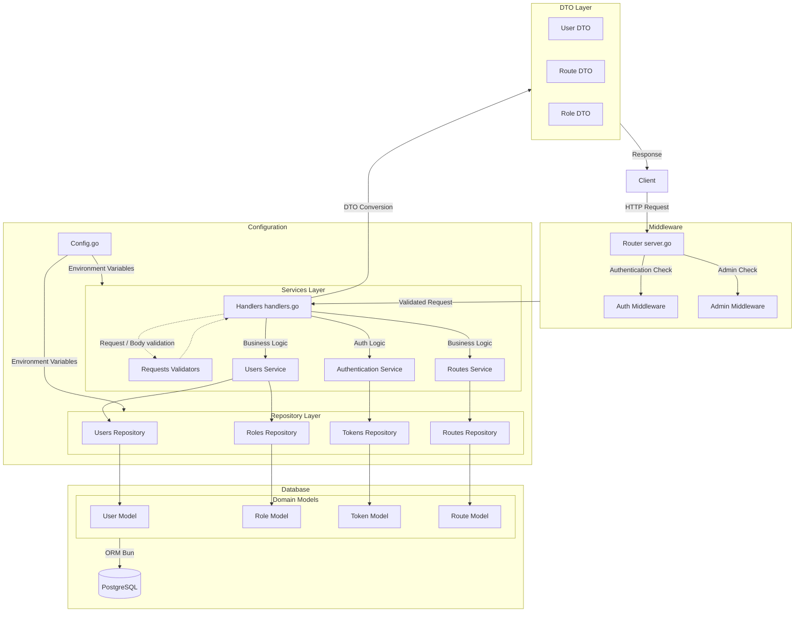

# supmap-users

Microservice de gestion des données utilisateurs pour Supmap

## Présentation

**supmap-users** est un microservice écrit en Go destiné à fournir l'ensemble des fonctionnalités directement liées à un utilisateur.
Il intègre une gestion de compte complète et d'authentification. 
Ce service est complètement stateless et peut être déployé selon une scalabilité verticale à condition de fournir les mêmes paramètres d'environnement.

Différents endpoints sont exposés :
- Authentification (Register, Login, Refresh etc...)
- Modification du compte
- Gestion des itinéraires enregistrés

Certaines routes sont publiques, d'autres nécessitent une authentification et d'autres sont réservés aux utilisateurs authentifiés comme administrateur.

## Architecture

Ce service implémente une architecture par couche avec des controllers (handlers), des services et des repositories.



```
supmap-users/
├── cmd/
│   └── api/
│       └── main.go           # Point d'entrée du microservice
├── internal/
│   ├── api/
│   │   ├── handlers.go       # Gestionnaires de requêtes HTTP
│   │   ├── server.go         # Configuration du serveur HTTP et routes
│   │   └── validations/       
│   │       └── ...           # Structures de validation
│   ├── config/
│   │   └── config.go         # Configuration des variables d'environnement
│   ├── models/
│   │   ├── dto/              # DTOs permettant d'exposer les données
│   │   └── ...               # Structures de données pour l'ORM Bun
│   ├── repository/           # Repository implémentant les requêtes SQL avec l'ORM Bun
│   │   └── ...
│   └── services/             # Services implémentant les fonctionnalités métier du service
│       ├── ...
├── docs/                     # Documentation Swagger auto implémentée avec Swggo
│   └── ...
├── Dockerfile                # Image Docker du microservice
├── go.mod                    # Dépendances Go
├── go.sum                    # Checksums des dépendances (auto généré)
└── README.md                 # Documentation du projet
```

## Prérequis et installation

- Go 1.24
- Base de données postgres (conteneurisée ou non)

### Démarrage rapide 

```sh
# Cloner le repo
git clone https://github.com/4PROJ-Le-projet-d-une-vie/supmap-users.git
cd supmap-users

# Démarrer le service (nécessite les variables d'environnement, voir ci-dessous)
go run ./cmd/api
```

### Avec Docker

```sh
docker pull ghcr.io/4proj-le-projet-d-une-vie/supmap-users:latest
docker run --env-file .env -p 8080:80 supmap-users
```

> NB: Nécessite une d'être authentifié pour accèder aux artefacts dans l'organisation Github du projet.

#### Authentification au registre GHCR

Pour pull l'image, il faut être authentifié par docker login.

- Générer un Personal Access Token sur GitHub :
    - Se rendre sur https://github.com/settings/tokens
    - Cliquer sur "Generate new token"
    - Cocher au minimum la permission read:packages
    - Copier le token
- Connecter Docker à GHCR avec le token :

```sh
echo 'YOUR_GITHUB_TOKEN' | docker login ghcr.io -u YOUR_GITHUB_USERNAME --password-stdin
```

## Configuration

La configuration se fait via des variables d'environnement ou un fichier `.env` :

|   Variable   | Description                                                                          |
|:------------:|:-------------------------------------------------------------------------------------|
|    `ENV`     | Définit l'environnement dans lequel est exécuté le programme (par défaut production) |
|   `DB_URL`   | URL complète vers la base de donnée                                                  |
|    `PORT`    | Port sur lequel écoutera le service pour recevoir les requêtes                       |
| `JWT_SECRET` | Secret permettant de vérifier l'authenticité d'un token JWT pour l'authentification  |

Ces variables sont chargés depuis le fichier [config.go](internal/config/config.go), à l'aide de la librairie [caarlos0/env](https://github.com/caarlos0/env).

## Swagger

Chaque handler de ce service comprend des commentaires [Swaggo](https://github.com/swaggo/swag) pour créer dynamiquement une page Swagger-ui.
Exécutez les commandes suivantes depuis la racine du projet pour générer la documentation :
```sh
# Installez l'interpréteur de commande Swag
go install github.com/swaggo/swag/cmd/swag@latest

# Générez la documentation
swag init -g cmd/api/main.go
```

Maintenant, vous pouvez accèder à l'URL http://localhost:8080/swagger/index.html décrivant la structure attendue pour chaque endpoint de l'application

> **NB:** La documentation n'inclut pas les endpoints /internal destinés à une utilisation exclusivement interne

## Authentification

Cette API utilise un système d’authentification basé sur JWT (JSON Web Tokens) avec un access token de courte durée et un refresh token de longue durée.

> NB: La description détaillée des endpoints est disponible dans la section suivante (Endpoints)

1. L'utilisateur peut s'enregistrer via l'endpoint `/register` en fournissant les informations suivantes dans le corps de la requête.
2. L’utilisateur peut se connecter via l’endpoint `/login` en utilisant **soit son email, soit son handle**, accompagné de son mot de passe
   - La réponse contient deux tokens, un **access_token valable 24h** et un **refresh_token valable 1 an**
   - L'access_token est à mettre dans le header `Authorization` pour être autorisé à appeler des endpoints sécurisés
     ```
     Authorization: Bearer <access_token>
     ```
3. Quand l’access_token expire, l’utilisateur peut obtenir un nouveau token sans se reconnecter via l’endpoint `/refresh`
4. L’utilisateur peut se déconnecter via l’endpoint `/logout`
   - Cela invalide tous les tokens actifs (access + refresh). 
   - Un nouveau refresh_token sera généré au prochain login.

## Migrations de base de données

Les migrations permettent de versionner la structure de la base de données et de suivre son évolution au fil du temps.
Elles garantissent que tous les environnements (développement, production, etc.) partagent le même schéma de base de données.

Ce projet utilise [Goose](https://github.com/pressly/goose) pour gérer les migrations SQL. Les fichiers de migration sont stockés dans le dossier `migrations/changelog/` et sont embarqués dans le binaire grâce à la directive `//go:embed` dans [main.go](migrations/migrate.go).

### Création d'une migration

Pour créer une nouvelle migration, installez d'abord le CLI Goose :

```sh
go install github.com/pressly/goose/v3/cmd/goose@latest
```

Puis créez une nouvelle migration (la commande se base sur les variables du fichier .env) :
```shell
# Crée une migration vide
goose -dir migrations/changelog create nom_de_la_migration sql

# La commande génère un fichier horodaté dans migrations/changelog/
# Example: 20240315143211_nom_de_la_migration.sql
```

### Exécution des migrations

Les migrations sont exécutées automatiquement au démarrage du service via le package migrations :
```go
// Dans main.go
if err := migrations.Migrate("pgx", conf.DbUrl, logger); err != nil {
    logger.Error("migration failed", "err", err)
}
```

Le package migrations utilise embed.FS pour embarquer les fichiers SQL dans le binaire :
```go
//go:embed changelog/*.sql
var changelog embed.FS
// Connexion à la base de données
goose.SetBaseFS(changelog)
```

## Endpoints

Les endpoints ci-dessous sont présentés selon l'ordre dans lequel ils sont définit dans [server.go](internal/api/server.go)

<details>
<summary>GET /users</summary>

### GET /users

Cet endpoint perm permet à un utilisateur authentifié en tant qu'administrateur, d'accéder à la liste de tous les utilisateurs existant.

#### Authentification / Autorisations

- L'utilisateur doit être authentifié (sinon code http 401)
- L'utilisateur doit avoir le role d'administrateur (sinon code http 403)

#### Paramètres / Corp de requête

Aucun paramètre ni corp de requête n'est requis pour cette requête

#### Réponse

```json
[
  {
    "id": 0,
    "email": "string",
    "handle": "string",
    "auth_provider": "string",
    "profile_picture": "string",
    "role": {
      "id": 0,
      "name": "string"
    },
    "created_at": "string",
    "updated_at": "string"
  },
  ...
]
```

> NB: La clé `auth_provider` est permet de savoir si l'utilisateur utilise un compte local ou distant avec de l'OAuth. Elle n'a pas été implémenté dans le projet donc sa valeur est toujours définit à "local"

#### Trace

```
mux.Handle("GET /users", s.AuthMiddleware()(s.AdminMiddleware()(s.GetUsers())))
└─> func (s *Server) AuthMiddleware() func(http.Handler) http.Handler { ... }                       # Authentifie l'utilisateur
    ├─> func (s *Service) GetUserByID(ctx context.Context, id int64) (*models.User, error)          # Récupération de l'utilisateur à partir des informations de son token JWT décodé
    ├─> func (s *Service) IsAuthenticated(ctx context.Context, user *models.User) bool              # Vérifie que la session de l'utilisateur est valide
    │   └─>func (t *Tokens) Get(ctx context.Context, user *models.User) (*models.Token, error)      # Récupère le refresh_token de l'utilisateur
    └─> func (s *Server) AdminMiddleware() func(http.Handler) http.Handler                          # Vérifie que l'utilisateur authentifié soit un administrateur
        ├─> func (s *Server) GetUsers() http.HandlerFunc                                            # Handler HTTP
        │   └─> func (s *Service) GetAllUsers(ctx context.Context) ([]models.User, error)           # Service
        │       └─> func (u *Users) FindAll(ctx context.Context) ([]models.User, error)             # Repository
        ├─> func UserToDTO(user *models.User) *UserDTO                                              # Conversion DTO
        └─> mathdeodrd.handler/func Encode[T any](v T, status int, w http.ResponseWriter) error     # Ecriture de la réponse avec une fonction générique
```
</details>

<details>
<summary>GET /users/{id}</summary>

### GET /users/{id}

Cet endpoint permet à un utilisateur authentifié en tant qu'administrateur d'accéder aux informations détaillées d'un utilisateur spécifique.

#### Authentification / Autorisations

- L'utilisateur doit être authentifié (sinon code http 401)
- L'utilisateur doit avoir le role d'administrateur (sinon code http 403)

#### Paramètres / Corps de requête

| Paramètre | Type  | Description                    |
|-----------|-------|--------------------------------|
| id        | int64 | Identifiant de l'utilisateur   |

#### Réponse

```json
{
  "id": 0,
  "email": "string",
  "handle": "string",
  "auth_provider": "string",
  "profile_picture": "string",
  "role": {
    "id": 0,
    "name": "string"
  },
  "created_at": "string",
  "updated_at": "string"
}
```

#### Trace

```
mux.Handle("GET /users/{id}", s.AuthMiddleware()(s.AdminMiddleware()(s.GetUserById())))
└─> func (s *Server) AuthMiddleware() func(http.Handler) http.Handler { ... }                       # Authentifie l'utilisateur
    ├─> func (s *Service) GetUserByID(ctx context.Context, id int64) (*models.User, error)          # Récupération de l'utilisateur à partir des informations de son token JWT décodé
    ├─> func (s *Service) IsAuthenticated(ctx context.Context, user *models.User) bool              # Vérifie que la session de l'utilisateur est valide
    │   └─>func (t *Tokens) Get(ctx context.Context, user *models.User) (*models.Token, error)      # Récupère le refresh_token de l'utilisateur
    └─> func (s *Server) AdminMiddleware() func(http.Handler) http.Handler                          # Vérifie que l'utilisateur authentifié soit un administrateur
        ├─> func (s *Server) GetUserById() http.HandlerFunc                                         # Handler HTTP
        │   └─> func (s *Service) GetUserByID(ctx context.Context, id int64) (*models.User, error)  # Service
        │       └─> func (u *Users) FindByID(ctx context.Context, id int64) (*models.User, error)   # Repository
        ├─> func UserToDTO(user *models.User) *UserDTO                                              # Conversion DTO
        └─> mathdeodrd.handler/func Encode[T any](v T, status int, w http.ResponseWriter) error     # Ecriture de la réponse avec une fonction générique
```
</details>

<details>
<summary>GET /users/me</summary>

### GET /users/me

Cet endpoint permet à un utilisateur authentifié d'accéder à ses propres informations.

#### Authentification / Autorisations

- L'utilisateur doit être authentifié (sinon code http 401)

#### Paramètres / Corps de requête

Aucun paramètre ni corps de requête n'est requis pour cette requête.
Les données de l'utilisateur sont récupérée avec son `access_token`

#### Réponse

```json
{
  "id": 0,
  "email": "string",
  "handle": "string",
  "auth_provider": "string",
  "profile_picture": "string",
  "role": {
    "id": 0,
    "name": "string"
  },
  "created_at": "string",
  "updated_at": "string"
}
```

#### Trace

```
mux.Handle("GET /users/me", s.AuthMiddleware()(s.GetMe()))
└─> func (s *Server) AuthMiddleware() func(http.Handler) http.Handler { ... }                       # Authentifie l'utilisateur
    ├─> func (s *Service) GetUserByID(ctx context.Context, id int64) (*models.User, error)          # Récupération de l'utilisateur à partir des informations de son token JWT décodé
    ├─> func (s *Service) IsAuthenticated(ctx context.Context, user *models.User) bool              # Vérifie que la session de l'utilisateur est valide
    │   └─>func (t *Tokens) Get(ctx context.Context, user *models.User) (*models.Token, error)      # Récupère le refresh_token de l'utilisateur
    └─> func (s *Server) GetMe() http.HandlerFunc                                                   # Handler HTTP qui récupère l'utilisateur depuis le contexte
        ├─> func UserToDTO(user *models.User) *UserDTO                                              # Conversion DTO
        └─> mathdeodrd.handler/func Encode[T any](v T, status int, w http.ResponseWriter) error     # Ecriture de la réponse avec une fonction générique
```
</details>

<details>
<summary>POST /login</summary>

### POST /login

Cet endpoint permet à un utilisateur de s'authentifier en utilisant soit son email, soit son handle avec son mot de passe. En cas de succès, il reçoit un access token et un refresh token.

#### Authentification / Autorisations

Aucune authentification n'est requise pour cet endpoint.

#### Paramètres / Corps de requête

```json
{
  "email": "string",
  "handle": "string",
  "password": "string"
}
```

Règles de validation :
- email : Optionnel si handle fourni. Doit être un email valide
- handle : Optionnel si email fourni. Doit commencer par '@'
- password : Requis

#### Réponse

```json
{
  "access_token": "string",
  "refresh_token": "string"
}
```

#### Trace

```
mux.Handle("POST /login", s.Login())
└─> func (s *Server) Login() http.HandlerFunc                                                           # Handler HTTP
    ├─> func (s *Service) Login(ctx context.Context, email, handle *string, password string)            # Service d'authentification
    │   ├─> func (u *Users) FindByEmail(ctx context.Context, email string) (*models.User, error)        # Repository - recherche par email
    │   └─> func (u *Users) FindByHandle(ctx context.Context, handle string) (*models.User, error)      # Repository - recherche par handle
    ├─> func (s *Service) Authenticate(ctx context.Context, user *models.User)                          # Génération des tokens
    │   └─> func (t *Tokens) Insert(ctx context.Context, token *models.Token) error                     # Sauvegarde du refresh token
    └─> mathdeodrd.handler/func Encode[T any](v T, status int, w http.ResponseWriter) error             # Ecriture de la réponse avec une fonction générique
```
</details>

<details>
<summary>POST /register</summary>

### POST /register

Cet endpoint permet à un utilisateur de créer un nouveau compte. En cas de succès, il reçoit les informations de son compte ainsi qu'un access token et un refresh token pour être directement authentifié.

#### Authentification / Autorisations

Aucune authentification n'est requise pour cet endpoint.

#### Paramètres / Corps de requête

```json
{
  "email": "string",
  "handle": "string",
  "password": "string",
  "profile_picture": "string"
}
```

Règles de validation :

- email : Requis, doit être un email valide
- handle : Requis, minimum 3 caractères, ne doit pas commencer par '@' (il sera ajouté automatiquement)
- password : Requis, minimum 8 caractères
- profile_picture : Optionnel, doit être une URL valide

#### Réponse

```json
{
  "user": {
    "id": 0,
    "email": "string",
    "handle": "string",
    "auth_provider": "string",
    "profile_picture": "string",
    "role": {
      "id": 0,
      "name": "string"
    },
    "created_at": "string",
    "updated_at": "string"
  },
  "tokens": {
    "access_token": "string",
    "refresh_token": "string"
  }
}
```

#### Trace

```
mux.Handle("POST /register", s.Register())
└─> func (s *Server) Register() http.HandlerFunc                                                    # Handler HTTP
    ├─> func (s *Service) CreateUser(ctx context.Context, body validations.CreateUserValidator)     # Service de création
    │   ├─> func (r *Roles) FindUserRole(ctx context.Context) (*models.Role, error)                 # Repository - récupération du rôle par défaut
    │   └─> func (u *Users) Insert(user *models.User, ctx context.Context) error                    # Repository - insertion du nouvel utilisateur
    ├─> func (s *Service) Authenticate(ctx context.Context, user *models.User)                      # Génération des tokens
    │   └─> func (t *Tokens) Insert(ctx context.Context, token *models.Token) error                 # Sauvegarde du refresh token
    ├─> func UserToDTO(user *models.User) *UserDTO                                                  # Conversion DTO
    └─> mathdeodrd.handler/func Encode[T any](v T, status int, w http.ResponseWriter) error         # Ecriture de la réponse avec une fonction générique
```
</details>

<details>
<summary>POST /refresh</summary>

### POST /refresh

Cet endpoint permet d'obtenir un nouveau access token à partir d'un refresh token valide, sans avoir à se réauthentifier avec ses identifiants.

#### Authentification / Autorisations

Aucune authentification n'est requise pour cet endpoint, mais un refresh token valide doit être fourni.

#### Paramètres / Corps de requête

```json
{
  "token": "string"
}
```

Règles de validation :

- token : Requis, doit être un refresh token valide précédemment obtenu via login ou register

#### Réponse

```json
{
  "access_token": "string"
}
```

#### Trace

```
mux.Handle("POST /refresh", s.Refresh())
└─> func (s *Server) Refresh() http.HandlerFunc                                                 # Handler HTTP
    ├─> func (s *Service) RefreshToken(ctx context.Context, refreshToken string)                # Service de refresh
    │   └─> func (t *Tokens) GetUserFromRefreshToken(ctx context.Context, refreshToken string)  # Repository - vérifie le token et récupère l'utilisateur
    ├─> func (s *Service) generateAccessToken(user *models.User)                                # Génération du nouveau token
    └─> mathdeodrd.handler/func Encode[T any](v T, status int, w http.ResponseWriter) error     # Ecriture de la réponse avec une fonction générique
```
</details>

<details>
<summary>POST /logout</summary>

### POST /logout

Cet endpoint permet à un utilisateur authentifié d'invalider son refresh token actuel, le déconnectant effectivement de l'application.

#### Authentification / Autorisations

- L'utilisateur doit être authentifié (sinon code http 401)

#### Paramètres / Corps de requête

```json
{
  "token": "string"
}
```

Règles de validation :

- token : Requis, doit être le refresh token actif de l'utilisateur authentifié

#### Réponse

Retourne un code 204 (No Content) en cas de succès.

#### Trace

```
mux.Handle("POST /logout", s.AuthMiddleware()(s.Logout()))
└─> func (s *Server) AuthMiddleware() func(http.Handler) http.Handler { ... }                       # Authentifie l'utilisateur
    ├─> func (s *Service) GetUserByID(ctx context.Context, id int64) (*models.User, error)          # Récupération de l'utilisateur à partir des informations de son token JWT décodé
    ├─> func (s *Service) IsAuthenticated(ctx context.Context, user *models.User) bool              # Vérifie que la session de l'utilisateur est valide
    │   └─>func (t *Tokens) Get(ctx context.Context, user *models.User) (*models.Token, error)      # Récupère le refresh_token de l'utilisateur
    └─> func (s *Server) Logout() http.HandlerFunc                                                  # Handler HTTP
        ├─> func (s *Service) Logout(ctx context.Context, user *models.User, refreshToken string)   # Service de déconnexion
        │   └─> func (t *Tokens) Delete(ctx context.Context, user *models.User) error               # Repository - suppression du refresh token
        └─> mathdeodrd.handler/func Encode[T any](v T, status int, w http.ResponseWriter) error     # Ecriture de la réponse avec une fonction générique
```
</details>

<details>
<summary>POST /users</summary>

### POST /users

Cet endpoint permet à un administrateur de créer un nouveau compte utilisateur avec un rôle spécifique.

#### Authentification / Autorisations

- L'utilisateur doit être authentifié (sinon code http 401)
- L'utilisateur doit avoir le role d'administrateur (sinon code http 403)

#### Paramètres / Corps de requête

```json
{
  "email": "string",
  "handle": "string",
  "password": "string",
  "role": "string"
}
```

Règles de validation :

- email : Requis, doit être un email valide
- handle : Requis, minimum 3 caractères, ne doit pas commencer par '@' (il sera ajouté automatiquement)
- password : Requis, minimum 8 caractères
- role : Requis, doit être un rôle existant dans la base de données ("ROLE_USER" ou "ROLE_ADMIN")

#### Réponse

```json
{
  "id": 0,
  "email": "string",
  "handle": "string",
  "auth_provider": "string",
  "profile_picture": "string",
  "role": {
    "id": 0,
    "name": "string"
  },
  "created_at": "string",
  "updated_at": "string"
}
```

#### Trace

```
mux.Handle("POST /users", s.AuthMiddleware()(s.AdminMiddleware()(s.CreateUser())))
└─> func (s *Server) AuthMiddleware() func(http.Handler) http.Handler { ... }                                           # Authentifie l'utilisateur
    ├─> func (s *Service) GetUserByID(ctx context.Context, id int64) (*models.User, error)                              # Récupération de l'utilisateur à partir des informations de son token JWT décodé
    ├─> func (s *Service) IsAuthenticated(ctx context.Context, user *models.User) bool                                  # Vérifie que la session de l'utilisateur est valide
    │   └─>func (t *Tokens) Get(ctx context.Context, user *models.User) (*models.Token, error)                          # Récupère le refresh_token de l'utilisateur
    └─> func (s *Server) AdminMiddleware() func(http.Handler) http.Handler                                              # Vérifie que l'utilisateur authentifié soit un administrateur
        ├─> func (s *Server) CreateUser() http.HandlerFunc                                                              # Handler HTTP
        │   └─> func (s *Service) CreateUserForAdmin(ctx context.Context, body validations.AdminCreateUserValidator)    # Service
        │       ├─> func (r *Roles) FindRole(ctx context.Context, role string)                                          # Repository - récupération du rôle spécifié
        │       └─> func (u *Users) Insert(user *models.User, ctx context.Context) error                                # Repository - insertion du nouvel utilisateur
        ├─> func UserToDTO(user *models.User) *UserDTO                                                                  # Conversion DTO
        └─> mathdeodrd.handler/func Encode[T any](v T, status int, w http.ResponseWriter) error                         # Ecriture de la réponse avec une fonction générique
```
</details>

<details>
<summary>PATCH /users/me</summary>

### PATCH /users/me

Cet endpoint permet à un utilisateur authentifié de mettre à jour ses propres informations. Retourne les informations mises à jour ainsi que de nouveaux tokens.

#### Authentification / Autorisations

- L'utilisateur doit être authentifié (sinon code http 401)

#### Paramètres / Corps de requête

```json
{
  "email": "string",
  "handle": "string",
  "profile_picture": "string"
}
```

Règles de validation :

- email : Optionnel, doit être un email valide
- handle : Optionnel, minimum 3 caractères, ne doit pas commencer par '@' (il sera ajouté automatiquement)
- profile_picture : Optionnel, doit être une URL valide ou null pour le supprimer

#### Réponse

```json
{
  "user": {
    "id": 0,
    "email": "string",
    "handle": "string",
    "auth_provider": "string",
    "profile_picture": "string",
    "role": {
      "id": 0,
      "name": "string"
    },
    "created_at": "string",
    "updated_at": "string"
  },
  "tokens": {
    "access_token": "string",
    "refresh_token": "string"
  }
}
```

#### Trace

```
mux.Handle("PATCH /users/me", s.AuthMiddleware()(s.PatchMe()))
└─> func (s *Server) AuthMiddleware() func(http.Handler) http.Handler { ... }                                   # Authentifie l'utilisateur
    ├─> func (s *Service) GetUserByID(ctx context.Context, id int64) (*models.User, error)                      # Récupération de l'utilisateur à partir des informations de son token JWT décodé
    ├─> func (s *Service) IsAuthenticated(ctx context.Context, user *models.User) bool                          # Vérifie que la session de l'utilisateur est valide
    │   └─>func (t *Tokens) Get(ctx context.Context, user *models.User) (*models.Token, error)                  # Récupère le refresh_token de l'utilisateur
    └─> func (s *Server) PatchMe() http.HandlerFunc                                                             # Handler HTTP
        ├─> func (s *Service) PatchUser(ctx context.Context, id int64, body validations.UpdateUserValidator)    # Service
        │   └─> func (u *Users) Update(user *models.User, ctx context.Context) error                            # Repository - mise à jour de l'utilisateur
        ├─> func (s *Service) Authenticate(ctx context.Context, user *models.User)                              # Génération des nouveaux tokens
        ├─> func UserToDTO(user *models.User) *UserDTO                                                          # Conversion DTO
        └─> mathdeodrd.handler/func Encode[T any](v T, status int, w http.ResponseWriter) error                 # Ecriture de la réponse avec une fonction générique
```
</details>

<details>
<summary>PATCH /users/{id}</summary>

### PATCH /users/{id}

Cet endpoint permet à un administrateur de mettre à jour les informations d'un utilisateur spécifique, y compris son rôle.

#### Authentification / Autorisations

- L'utilisateur doit être authentifié (sinon code http 401)
- L'utilisateur doit avoir le role d'administrateur (sinon code http 403)

#### Paramètres / Corps de requête

| Paramètre | Type  | Description                    |
|-----------|-------|--------------------------------|
| id        | int64 | Identifiant de l'utilisateur   |

```json
{
  "email": "string",
  "handle": "string",
  "password": "string",
  "profile_picture": "string",
  "role": "string"
}
```

Règles de validation :

- email : Optionnel, doit être un email valide
- handle : Optionnel, minimum 3 caractères, ne doit pas commencer par '@' (il sera ajouté automatiquement)
- profile_picture : Optionnel, doit être une URL valide ou null pour le supprimer

#### Réponse

```json
{
  "user": {
    "id": 0,
    "email": "string",
    "handle": "string",
    "auth_provider": "string",
    "profile_picture": "string",
    "role": {
      "id": 0,
      "name": "string"
    },
    "created_at": "string",
    "updated_at": "string"
  },
  "tokens": {
    "access_token": "string",
    "refresh_token": "string"
  }
}
```

#### Trace

```
mux.Handle("PATCH /users/me", s.AuthMiddleware()(s.PatchMe()))
└─> func (s *Server) AuthMiddleware() func(http.Handler) http.Handler { ... }                                   # Authentifie l'utilisateur
    ├─> func (s *Service) GetUserByID(ctx context.Context, id int64) (*models.User, error)                      # Récupération de l'utilisateur à partir des informations de son token JWT décodé
    ├─> func (s *Service) IsAuthenticated(ctx context.Context, user *models.User) bool                          # Vérifie que la session de l'utilisateur est valide
    │   └─>func (t *Tokens) Get(ctx context.Context, user *models.User) (*models.Token, error)                  # Récupère le refresh_token de l'utilisateur
    └─> func (s *Server) PatchMe() http.HandlerFunc                                                             # Handler HTTP
        ├─> func (s *Service) PatchUser(ctx context.Context, id int64, body validations.UpdateUserValidator)    # Service
        │   └─> func (u *Users) Update(user *models.User, ctx context.Context) error                            # Repository - mise à jour de l'utilisateur
        ├─> func (s *Service) Authenticate(ctx context.Context, user *models.User)                              # Génération des nouveaux tokens
        ├─> func UserToDTO(user *models.User) *UserDTO                                                          # Conversion DTO
        └─> mathdeodrd.handler/func Encode[T any](v T, status int, w http.ResponseWriter) error                 # Ecriture de la réponse avec une fonction générique
```
</details>

<details>
<summary>PATCH /users/{id}</summary>

### PATCH /users/{id}

Cet endpoint permet à un administrateur de modifier les informations d'un utilisateur spécifique, y compris son rôle.

#### Authentification / Autorisations

- L'utilisateur doit être authentifié (sinon code http 401)
- L'utilisateur doit avoir le role d'administrateur (sinon code http 403)

#### Paramètres / Corps de requête

| Paramètre | Type  | Description                    |
|-----------|-------|--------------------------------|
| id        | int64 | Identifiant de l'utilisateur   |

```json
{
  "email": "string",
  "handle": "string",
  "password": "string",
  "profile_picture": "string",
  "role": "string"
}
```

Règles de validation :

- email : Optionnel, doit être un email valide
- handle : Optionnel, minimum 3 caractères, ne doit pas commencer par '@' (il sera ajouté automatiquement)
- password : Optionnel, minimum 8 caractères
- profile_picture : Optionnel, doit être une URL valide ou null pour le supprimer
- role : Optionnel, doit être un rôle existant dans la base de données ("ROLE_USER" ou "ROLE_ADMIN")

#### Réponse

```json
{
  "user": {
    "id": 0,
    "email": "string",
    "handle": "string",
    "auth_provider": "string",
    "profile_picture": "string",
    "role": {
      "id": 0,
      "name": "string"
    },
    "created_at": "string",
    "updated_at": "string"
  },
  "tokens": {
    "access_token": "string",
    "refresh_token": "string"
  }
}
```

#### Trace

```
mux.Handle("PATCH /users/{id}", s.AuthMiddleware()(s.AdminMiddleware()(s.PatchUser())))
└─> func (s *Server) AuthMiddleware() func(http.Handler) http.Handler { ... }                                                   # Authentifie l'utilisateur
    ├─> func (s *Service) GetUserByID(ctx context.Context, id int64) (*models.User, error)                                      # Récupération de l'utilisateur à partir des informations de son token JWT décodé
    ├─> func (s *Service) IsAuthenticated(ctx context.Context, user *models.User) bool                                          # Vérifie que la session de l'utilisateur est valide
    │   └─>func (t *Tokens) Get(ctx context.Context, user *models.User) (*models.Token, error)                                  # Récupère le refresh_token de l'utilisateur
    └─> func (s *Server) AdminMiddleware() func(http.Handler) http.Handler                                                      # Vérifie que l'utilisateur authentifié soit un administrateur
        ├─> func (s *Server) PatchUser() http.HandlerFunc                                                                       # Handler HTTP
        │   └─> func (s *Service) PatchUserForAdmin(ctx context.Context, id int64, body *validations.AdminUpdateUserValidator)  # Service
        │       ├─> func (r *Roles) FindRole(ctx context.Context, role string)                                                  # Repository - récupération du rôle si modifié
        │       └─> func (u *Users) Update(user *models.User, ctx context.Context) error                                        # Repository - mise à jour de l'utilisateur
        ├─> func (s *Service) Authenticate(ctx context.Context, user *models.User)                                              # Génération des nouveaux tokens
        ├─> func UserToDTO(user *models.User) *UserDTO                                                                          # Conversion DTO
        └─> mathdeodrd.handler/func Encode[T any](v T, status int, w http.ResponseWriter) error                                 # Ecriture de la réponse avec une fonction générique
```
</details>

<details>
<summary>DELETE /users/{id}</summary>

### DELETE /users/{id}

Cet endpoint permet de supprimer un compte utilisateur. Un utilisateur peut supprimer son propre compte, ou un administrateur peut supprimer n'importe quel compte.

#### Authentification / Autorisations

- L'utilisateur doit être authentifié (sinon code http 401)
- L'utilisateur doit soit être l'utilisateur ciblé, soit être administrateur (sinon code http 403)

#### Paramètres / Corps de requête

| Paramètre | Type  | Description                    |
|-----------|-------|--------------------------------|
| id        | int64 | Identifiant de l'utilisateur   |

Aucun corps de requête n'est requis pour cette requête.

#### Réponse

Retourne un code 204 (No Content) en cas de succès.

#### Trace

```
mux.Handle("DELETE /users/{id}", s.AuthMiddleware()(s.DeleteUser()))
└─> func (s *Server) AuthMiddleware() func(http.Handler) http.Handler { ... }                       # Authentifie l'utilisateur
    ├─> func (s *Service) GetUserByID(ctx context.Context, id int64) (*models.User, error)          # Récupération de l'utilisateur à partir des informations de son token JWT décodé
    ├─> func (s *Service) IsAuthenticated(ctx context.Context, user *models.User) bool              # Vérifie que la session de l'utilisateur est valide
    │   └─>func (t *Tokens) Get(ctx context.Context, user *models.User) (*models.Token, error)      # Récupère le refresh_token de l'utilisateur
    └─> func (s *Server) DeleteUser() http.HandlerFunc                                              # Handler HTTP qui vérifie si l'utilisateur est admin ou propriétaire
        └─> func (s *Service) DeleteUser(ctx context.Context, id int64) error                       # Service
            ├─> func (u *Users) FindByID(ctx context.Context, id int64) (*models.User, error)       # Repository - vérifie l'existence de l'utilisateur
            └─> func (u *Users) Delete(ctx context.Context, id int64) error                         # Repository - suppression de l'utilisateur
```
</details>

<details>
<summary>PATCH /users/me/update-password</summary>

### PATCH /users/me/update-password

Cet endpoint permet à un utilisateur authentifié de mettre à jour son mot de passe. L'ancien mot de passe doit être fourni pour des raisons de sécurité.

#### Authentification / Autorisations

- L'utilisateur doit être authentifié (sinon code http 401)

#### Paramètres / Corps de requête

```json
{
  "old": "string",
  "new": "string"
}
```

Règles de validation :

- old : Requis, doit correspondre au mot de passe actuel de l'utilisateur
- new : Requis, minimum 8 caractères, doit être différent de l'ancien mot de passe

#### Réponse

```json
{
  "id": 0,
  "email": "string",
  "handle": "string",
  "auth_provider": "string",
  "profile_picture": "string",
  "role": {
    "id": 0,
    "name": "string"
  },
  "created_at": "string",
  "updated_at": "string"
}
```

#### Trace

```
mux.Handle("PATCH /users/me/update-password", s.AuthMiddleware()(s.UpdatePassword()))
└─> func (s *Server) AuthMiddleware() func(http.Handler) http.Handler { ... }                                                   # Authentifie l'utilisateur
    ├─> func (s *Service) GetUserByID(ctx context.Context, id int64) (*models.User, error)                                      # Récupération de l'utilisateur à partir des informations de son token JWT décodé
    ├─> func (s *Service) IsAuthenticated(ctx context.Context, user *models.User) bool                                          # Vérifie que la session de l'utilisateur est valide
    │   └─>func (t *Tokens) Get(ctx context.Context, user *models.User) (*models.Token, error)                                  # Récupère le refresh_token de l'utilisateur
    └─> func (s *Server) UpdatePassword() http.HandlerFunc                                                                      # Handler HTTP
        ├─> func (s *Service) UpdatePassword(ctx context.Context, user *models.User, body validations.UpdatePasswordValidator)  # Service
        │   ├─> func (s *Service) checkPassword(password string, user *models.User) error                                       # Vérifie l'ancien mot de passe
        │   └─> func (u *Users) Update(user *models.User, ctx context.Context) error                                            # Repository - mise à jour du mot de passe
        ├─> func UserToDTO(user *models.User) *UserDTO                                                                          # Conversion DTO
        └─> mathdeodrd.handler/func Encode[T any](v T, status int, w http.ResponseWriter) error                                 # Ecriture de la réponse avec une fonction générique
```
</details>

<details>
<summary>GET /users/me/routes</summary>

### GET /users/me/routes

Cet endpoint permet à un utilisateur authentifié de récupérer la liste de tous ses itinéraires enregistrés.

#### Authentification / Autorisations

- L'utilisateur doit être authentifié (sinon code http 401)

#### Paramètres / Corps de requête

Aucun paramètre ni corps de requête n'est requis pour cette requête.

#### Réponse

```json
[
  {
    "id": 0,
    "name": "string",
    "route": [
      {
        "lat": 0.0,
        "lon": 0.0
      }
    ],
    "created_at": "string",
    "updated_at": "string"
  },
  ...
]
```

#### Trace

```
mux.Handle("GET /users/me/routes", s.AuthMiddleware()(s.getUserRoutes()))
└─> func (s *Server) AuthMiddleware() func(http.Handler) http.Handler { ... }                       # Authentifie l'utilisateur
    ├─> func (s *Service) GetUserByID(ctx context.Context, id int64) (*models.User, error)          # Récupération de l'utilisateur à partir des informations de son token JWT décodé
    ├─> func (s *Service) IsAuthenticated(ctx context.Context, user *models.User) bool              # Vérifie que la session de l'utilisateur est valide
    │   └─>func (t *Tokens) Get(ctx context.Context, user *models.User) (*models.Token, error)      # Récupère le refresh_token de l'utilisateur
    └─> func (s *Server) getUserRoutes() http.HandlerFunc                                           # Handler HTTP
        ├─> func (s *Service) GetUserRoutes(ctx context.Context, user *models.User)                 # Service
        │   └─> func (r *Routes) GetAllOfUser(ctx context.Context, user *models.User)               # Repository - récupération des routes
        ├─> func RouteToDTO(route *models.Route) *RouteDTO                                          # Conversion DTO
        └─> mathdeodrd.handler/func Encode[T any](v T, status int, w http.ResponseWriter) error     # Ecriture de la réponse avec une fonction générique
```
</details>

<details>
<summary>GET /users/me/routes/{routeId}</summary>

### GET /users/me/routes/{routeId}

Cet endpoint permet à un utilisateur authentifié de récupérer un itinéraire spécifique parmi ses routes enregistrées.

#### Authentification / Autorisations

- L'utilisateur doit être authentifié (sinon code http 401)

#### Paramètres / Corps de requête

| Paramètre | Type  | Description                  |
|-----------|-------|------------------------------|
| routeId   | int64 | Identifiant de l'itinéraire  |

Aucun corps de requête n'est requis pour cette requête.

#### Réponse

```json
{
  "id": 0,
  "name": "string",
  "route": [
    {
      "lat": 0.0,
      "lon": 0.0
    },
    ...
  ],
  "created_at": "string",
  "updated_at": "string"
}
```

#### Trace

```
mux.Handle("GET /users/me/routes/{routeId}", s.AuthMiddleware()(s.GetUserRoutesById()))
└─> func (s *Server) AuthMiddleware() func(http.Handler) http.Handler { ... }                       # Authentifie l'utilisateur
    ├─> func (s *Service) GetUserByID(ctx context.Context, id int64) (*models.User, error)          # Récupération de l'utilisateur à partir des informations de son token JWT décodé
    ├─> func (s *Service) IsAuthenticated(ctx context.Context, user *models.User) bool              # Vérifie que la session de l'utilisateur est valide
    │   └─>func (t *Tokens) Get(ctx context.Context, user *models.User) (*models.Token, error)      # Récupère le refresh_token de l'utilisateur
    └─> func (s *Server) GetUserRoutesById() http.HandlerFunc                                       # Handler HTTP
        ├─> func (s *Service) GetUserRouteById(ctx context.Context, userId, routeId int64)          # Service
        │   └─> func (r *Routes) GetRouteUserById(ctx context.Context, userId, routeId int64)       # Repository - récupération de la route spécifique
        ├─> func RouteToDTO(route *models.Route) *RouteDTO                                          # Conversion DTO
        └─> mathdeodrd.handler/func Encode[T any](v T, status int, w http.ResponseWriter) error     # Ecriture de la réponse avec une fonction générique
```
</details>

<details>
<summary>POST /users/me/routes</summary>

### POST /users/me/routes

Cet endpoint permet à un utilisateur authentifié de créer un nouvel itinéraire.

#### Authentification / Autorisations

- L'utilisateur doit être authentifié (sinon code http 401)

#### Paramètres / Corps de requête

```json
{
  "name": "string",
  "route": [
    {
      "lat": 0.0,
      "lon": 0.0
    },
    ...
  ]
}
```

Règles de validation :

- name : Requis, nom de l'itinéraire
- route : Requis, tableau de points contenant au moins une coordonnée
- route[].lat : Requis, latitude en degrés décimaux
- route[].lon : Requis, longitude en degrés décimaux

#### Réponse

```json
{
  "id": 0,
  "name": "string",
  "route": [
    {
      "lat": 0.0,
      "lon": 0.0
    },
    ...
  ],
  "created_at": "string",
  "updated_at": "string"
}
```

#### Trace

```
mux.Handle("POST /users/me/routes", s.AuthMiddleware()(s.CreateUserRoute()))
└─> func (s *Server) AuthMiddleware() func(http.Handler) http.Handler { ... }                                                   # Authentifie l'utilisateur
    ├─> func (s *Service) GetUserByID(ctx context.Context, id int64) (*models.User, error)                                      # Récupération de l'utilisateur à partir des informations de son token JWT décodé
    ├─> func (s *Service) IsAuthenticated(ctx context.Context, user *models.User) bool                                          # Vérifie que la session de l'utilisateur est valide
    │   └─>func (t *Tokens) Get(ctx context.Context, user *models.User) (*models.Token, error)                                  # Récupère le refresh_token de l'utilisateur
    └─> func (s *Server) CreateUserRoute() http.HandlerFunc                                                                     # Handler HTTP
        ├─> func (s *Service) CreateRouteForUser(ctx context.Context, user *models.User, route *validations.RouteValidator)     # Service
        │   └─> func (r *Routes) InsertRoute(ctx context.Context, route *models.Route)                                          # Repository - création de la route
        ├─> func RouteToDTO(route *models.Route) *RouteDTO                                                                      # Conversion DTO
        └─> mathdeodrd.handler/func Encode[T any](v T, status int, w http.ResponseWriter) error                                 # Ecriture de la réponse avec une fonction générique
```
</details>

<details>
<summary>PATCH /users/me/routes/{routeId}</summary>

### PATCH /users/me/routes/{routeId}

Cet endpoint permet à un utilisateur authentifié de modifier un de ses itinéraires existants.

#### Authentification / Autorisations

- L'utilisateur doit être authentifié (sinon code http 401)

#### Paramètres / Corps de requête

| Paramètre | Type  | Description                  |
|-----------|-------|------------------------------|
| routeId   | int64 | Identifiant de l'itinéraire  |

```json
{
  "name": "string",
  "route": [
    {
      "lat": 0.0,
      "lon": 0.0
    },
    ...
  ]
}
```

Règles de validation :

- name : Requis, nouveau nom de l'itinéraire
- route : Requis, nouveau tableau de points contenant au moins une coordonnée
- route[].lat : Requis, latitude en degrés décimaux
- route[].lon : Requis, longitude en degrés décimaux

#### Réponse

```json
{
  "id": 0,
  "name": "string",
  "route": [
    {
      "lat": 0.0,
      "lon": 0.0
    },
    ...
  ],
  "created_at": "string",
  "updated_at": "string"
}
```

#### Trace

```
mux.Handle("PATCH /users/me/routes/{routeId}", s.AuthMiddleware()(s.PatchUserRoute()))
└─> func (s *Server) AuthMiddleware() func(http.Handler) http.Handler { ... }                                                               # Authentifie l'utilisateur
    ├─> func (s *Service) GetUserByID(ctx context.Context, id int64) (*models.User, error)                                                  # Récupération de l'utilisateur à partir des informations de son token JWT décodé
    ├─> func (s *Service) IsAuthenticated(ctx context.Context, user *models.User) bool                                                      # Vérifie que la session de l'utilisateur est valide
    │   └─>func (t *Tokens) Get(ctx context.Context, user *models.User) (*models.Token, error)                                              # Récupère le refresh_token de l'utilisateur
    └─> func (s *Server) PatchUserRoute() http.HandlerFunc                                                                                  # Handler HTTP
        ├─> func (s *Service) PatchUserRoute(ctx context.Context, user *models.User, routeId int64, route *validations.RouteValidator)      # Service
        │   ├─> func (r *Routes) GetRouteUserById(ctx context.Context, userId, routeId int64)                                               # Repository - vérifie l'existence de la route
        │   └─> func (r *Routes) UpdateRoute(ctx context.Context, route *models.Route)                                                      # Repository - mise à jour de la route
        ├─> func RouteToDTO(route *models.Route) *RouteDTO                                                                                  # Conversion DTO
        └─> mathdeodrd.handler/func Encode[T any](v T, status int, w http.ResponseWriter) error                                             # Ecriture de la réponse avec une fonction générique
```
</details>

<details>
<summary>DELETE /users/me/routes/{routeId}</summary>

### DELETE /users/me/routes/{routeId}

Cet endpoint permet à un utilisateur authentifié de supprimer un de ses itinéraires.

#### Authentification / Autorisations

- L'utilisateur doit être authentifié (sinon code http 401)

#### Paramètres / Corps de requête

| Paramètre | Type  | Description                  |
|-----------|-------|------------------------------|
| routeId   | int64 | Identifiant de l'itinéraire  |

Aucun corps de requête n'est requis pour cette requête.

#### Réponse

Retourne un code 204 (No Content) en cas de succès.

#### Trace

```
mux.Handle("DELETE /users/me/routes/{routeId}", s.AuthMiddleware()(s.DeleteUserRoute()))
└─> func (s *Server) AuthMiddleware() func(http.Handler) http.Handler { ... }                       # Authentifie l'utilisateur
    ├─> func (s *Service) GetUserByID(ctx context.Context, id int64) (*models.User, error)          # Récupération de l'utilisateur à partir des informations de son token JWT décodé
    ├─> func (s *Service) IsAuthenticated(ctx context.Context, user *models.User) bool              # Vérifie que la session de l'utilisateur est valide
    │   └─>func (t *Tokens) Get(ctx context.Context, user *models.User) (*models.Token, error)      # Récupère le refresh_token de l'utilisateur
    └─> func (s *Server) DeleteUserRoute() http.HandlerFunc                                         # Handler HTTP
        ├─> func (s *Service) DeleteRoute(ctx context.Context, routeId int64, user *models.User)    # Service
        │   ├─> func (r *Routes) GetRouteUserById(ctx context.Context, userId, routeId int64)       # Repository - vérifie l'existence de la route
        │   └─> func (r *Routes) DeleteRoute(ctx context.Context, routeId, userId int64)            # Repository - suppression de la route
        └─> mathdeodrd.handler/func Encode[T any](v T, status int, w http.ResponseWriter) error     # Ecriture de la réponse avec une fonction générique
```
</details>