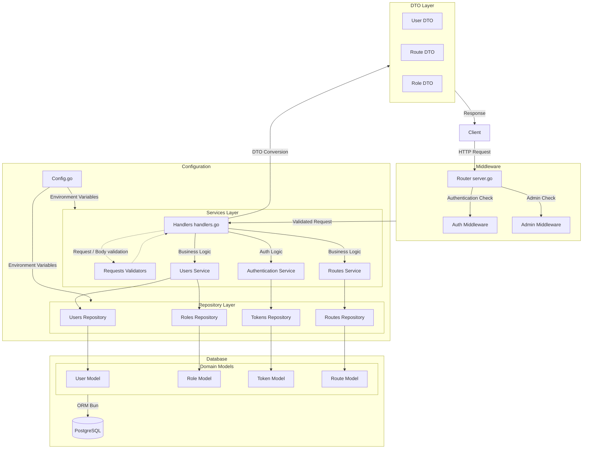

# supmap-users

Microservice de gestion des données utilisateurs pour Supmap

## Présentation

**supmap-users** est un microservice écrit en Go destiné à fournir l'ensemble des fonctionnalités directement liées à un utilisateur.
Il intègre une gestion de compte complète et d'authentification. 
Ce service est complètement stateless et peut être déployé selon une scalabilité verticale à condition de fournir les mêmes paramètres d'environnement.

Différents endpoints sont exposés :
- Authentification (Register, Login, Refresh etc...)
- Modification du compte
- Gestion des itinéraires enregistrés

Certaines routes sont publiques, d'autres nécessitent une authentification et d'autres sont réservés aux utilisateurs authentifiés comme administrateur.

## Architecture

Ce service implémente une architecture par couche avec des controllers (handlers), des services et des repositories.



```
supmap-users/
├── cmd/
│   └── api/
│       └── main.go           # Point d'entrée du microservice
├── internal/
│   ├── api/
│   │   ├── handlers.go       # Gestionnaires de requêtes HTTP
│   │   ├── server.go         # Configuration du serveur HTTP et routes
│   │   └── validations/       
│   │       └── ...           # Structures de validation
│   ├── config/
│   │   └── config.go         # Configuration des variables d'environnement
│   ├── models/
│   │   ├── dto/              # DTOs permettant d'exposer les données
│   │   └── ...               # Structures de données pour l'ORM Bun
│   ├── repository/           # Repository implémentant les requêtes SQL avec l'ORM Bun
│   │   └── ...
│   └── services/             # Services implémentant les fonctionnalités métier du service
│       ├── ...
├── docs/                     # Documentation Swagger auto implémentée avec Swggo
│   └── ...
├── Dockerfile                # Image Docker du microservice
├── go.mod                    # Dépendances Go
├── go.sum                    # Checksums des dépendances (auto généré)
└── README.md                 # Documentation du projet
```

## Prérequis et installation

- Go 1.24
- Base de données postgres (conteneurisée ou non)

### Démarrage rapide 

```sh
# Cloner le repo
git clone https://github.com/4PROJ-Le-projet-d-une-vie/supmap-users.git
cd supmap-users

# Démarrer le service (nécessite les variables d'environnement, voir ci-dessous)
go run ./cmd/api
```

### Avec Docker

```sh
docker pull ghcr.io/4proj-le-projet-d-une-vie/supmap-users:latest
docker run --env-file .env -p 8080:80 supmap-users
```

> NB: Nécessite une d'être authentifié pour accèder aux artefacts dans l'organisation Github du projet.

#### Authentification au registre GHCR

Pour pull l'image, il faut être authentifié par docker login.

- Générer un Personal Access Token sur GitHub :
    - Se rendre sur https://github.com/settings/tokens
    - Cliquer sur "Generate new token"
    - Cocher au minimum la permission read:packages
    - Copier le token
- Connecter Docker à GHCR avec le token :

```sh
echo 'YOUR_GITHUB_TOKEN' | docker login ghcr.io -u YOUR_GITHUB_USERNAME --password-stdin
```

## Configuration

La configuration se fait via des variables d'environnement ou un fichier `.env` :

|   Variable   | Description                                                                          |
|:------------:|:-------------------------------------------------------------------------------------|
|    `ENV`     | Définit l'environnement dans lequel est exécuté le programme (par défaut production) |
|   `DB_URL`   | URL complète vers la base de donnée                                                  |
|    `PORT`    | Port sur lequel écoutera le service pour recevoir les requêtes                       |
| `JWT_SECRET` | Secret permettant de vérifier l'authenticité d'un token JWT pour l'authentification  |

Ces variables sont chargés depuis le fichier [config.go](internal/config/config.go), à l'aide de la librairie [caarlos0/env](https://github.com/caarlos0/env).

## Swagger

Chaque handler de ce service comprend des commentaires [Swaggo](https://github.com/swaggo/swag) pour créer dynamiquement une page Swagger-ui.
Exécutez les commandes suivantes depuis la racine du projet pour générer la documentation :
```sh
# Installez l'interpréteur de commande Swag
go install github.com/swaggo/swag/cmd/swag@latest

# Générez la documentation
swag init -g cmd/api/main.go
```

Maintenant, vous pouvez accèder à l'URL http://localhost:8080/swagger/index.html décrivant la structure attendue pour chaque endpoint de l'application

> **NB:** La documentation n'inclut pas les endpoints /internal destinés à une utilisation exclusivement interne

## Authentification

Cette API utilise un système d’authentification basé sur JWT (JSON Web Tokens) avec un access token de courte durée et un refresh token de longue durée.

> NB: La description détaillée des endpoints est disponible dans la section suivante (Endpoints)

1. L'utilisateur peut s'enregistrer via l'endpoint `/register` en fournissant les informations suivantes dans le corps de la requête.
2. L’utilisateur peut se connecter via l’endpoint `/login` en utilisant **soit son email, soit son handle**, accompagné de son mot de passe
   - La réponse contient deux tokens, un **access_token valable 24h** et un **refresh_token valable 1 an**
   - L'access_token est à mettre dans le header `Authorization` pour être autorisé à appeler des endpoints sécurisés
     ```
     Authorization: Bearer <access_token>
     ```
3. Quand l’access_token expire, l’utilisateur peut obtenir un nouveau token sans se reconnecter via l’endpoint `/refresh`
4. L’utilisateur peut se déconnecter via l’endpoint `/logout`
   - Cela invalide tous les tokens actifs (access + refresh). 
   - Un nouveau refresh_token sera généré au prochain login.

## Endpoints

Les endpoints ci-dessous sont présentés selon l'ordre dans lequel ils sont définit dans [server.go](internal/api/server.go)

### GET /users

Cet endpoint perm permet à un utilisateur authentifié en tant qu'administrateur, d'accéder à la liste de tous les utilisateurs existant.

#### Authentification / Autorisations

- L'utilisateur doit être authentifié (sinon code http 401)
- L'utilisateur doit avoir le role d'administrateur (sinon code http 403)

#### Paramètres / Corp de requête

Aucun paramètre ni corp de requête n'est requis pour cette requête

#### Réponse

```json
[
  {
    "id": 0,
    "email": "string",
    "handle": "string",
    "auth_provider": "string",
    "profile_picture": "string",
    "role": {
      "id": 0,
      "name": "string"
    },
    "created_at": "string",
    "updated_at": "string"
  },
  ...
]
```

> NB: La clé `auth_provider` est permet de savoir si l'utilisateur utilise un compte local ou distant avec de l'OAuth. Elle n'a pas été implémenté dans le projet donc sa valeur est toujours définit à "local"

#### Trace

```
mux.Handle("GET /users", s.AuthMiddleware()(s.AdminMiddleware()(s.GetUsers())))
└─> func (s *Server) AuthMiddleware() func(http.Handler) http.Handler { ... }                       # Authentifie l'utilisateur
    ├─> func (s *Service) GetUserByID(ctx context.Context, id int64) (*models.User, error)          # Récupération de l'utilisateur à partir des informations de son token JWT décodé
    ├─> func (s *Service) IsAuthenticated(ctx context.Context, user *models.User) bool              # Vérifie que la session de l'utilisateur est valide
    │   └─>func (t *Tokens) Get(ctx context.Context, user *models.User) (*models.Token, error)      # Récupère le refresh_token de l'utilisateur
    └─> func (s *Server) AdminMiddleware() func(http.Handler) http.Handler                          # Vérifie que l'utilisateur authentifié soit un administrateur
        ├─> func (s *Server) GetUsers() http.HandlerFunc                                            # Handler HTTP
        │   └─> func (s *Service) GetAllUsers(ctx context.Context) ([]models.User, error)           # Service
        │       └─> func (u *Users) FindAll(ctx context.Context) ([]models.User, error)             # Repository
        ├─> func UserToDTO(user *models.User) *UserDTO                                              # Conversion DTO
        └─> mathdeodrd.handler/func Encode[T any](v T, status int, w http.ResponseWriter) error     # Ecriture de la réponse avec une fonction générique
```

### GET /users/{id}

Cet endpoint permet à un utilisateur authentifié en tant qu'administrateur d'accéder aux informations détaillées d'un utilisateur spécifique.

#### Authentification / Autorisations

- L'utilisateur doit être authentifié (sinon code http 401)
- L'utilisateur doit avoir le role d'administrateur (sinon code http 403)

#### Paramètres / Corps de requête

| Paramètre | Type  | Description                    |
|-----------|-------|--------------------------------|
| id        | int64 | Identifiant de l'utilisateur   |

#### Réponse

```json
{
  "id": 0,
  "email": "string",
  "handle": "string",
  "auth_provider": "string",
  "profile_picture": "string",
  "role": {
    "id": 0,
    "name": "string"
  },
  "created_at": "string",
  "updated_at": "string"
}
```

#### Trace

```
mux.Handle("GET /users/{id}", s.AuthMiddleware()(s.AdminMiddleware()(s.GetUserById())))
└─> func (s *Server) AuthMiddleware() func(http.Handler) http.Handler { ... }                       # Authentifie l'utilisateur
    ├─> func (s *Service) GetUserByID(ctx context.Context, id int64) (*models.User, error)          # Récupération de l'utilisateur à partir des informations de son token JWT décodé
    ├─> func (s *Service) IsAuthenticated(ctx context.Context, user *models.User) bool              # Vérifie que la session de l'utilisateur est valide
    │   └─>func (t *Tokens) Get(ctx context.Context, user *models.User) (*models.Token, error)      # Récupère le refresh_token de l'utilisateur
    └─> func (s *Server) AdminMiddleware() func(http.Handler) http.Handler                          # Vérifie que l'utilisateur authentifié soit un administrateur
        ├─> func (s *Server) GetUserById() http.HandlerFunc                                         # Handler HTTP
        │   └─> func (s *Service) GetUserByID(ctx context.Context, id int64) (*models.User, error)  # Service
        │       └─> func (u *Users) FindByID(ctx context.Context, id int64) (*models.User, error)   # Repository
        ├─> func UserToDTO(user *models.User) *UserDTO                                              # Conversion DTO
        └─> mathdeodrd.handler/func Encode[T any](v T, status int, w http.ResponseWriter) error     # Ecriture de la réponse avec une fonction générique
```

### GET /users/me

Cet endpoint permet à un utilisateur authentifié d'accéder à ses propres informations.

#### Authentification / Autorisations

- L'utilisateur doit être authentifié (sinon code http 401)

#### Paramètres / Corps de requête

Aucun paramètre ni corps de requête n'est requis pour cette requête.
Les données de l'utilisateur sont récupérée avec son `access_token`

#### Réponse

```json
{
  "id": 0,
  "email": "string",
  "handle": "string",
  "auth_provider": "string",
  "profile_picture": "string",
  "role": {
    "id": 0,
    "name": "string"
  },
  "created_at": "string",
  "updated_at": "string"
}
```

#### Trace

```
mux.Handle("GET /users/me", s.AuthMiddleware()(s.GetMe()))
└─> func (s *Server) AuthMiddleware() func(http.Handler) http.Handler { ... }                       # Authentifie l'utilisateur
    ├─> func (s *Service) GetUserByID(ctx context.Context, id int64) (*models.User, error)          # Récupération de l'utilisateur à partir des informations de son token JWT décodé
    ├─> func (s *Service) IsAuthenticated(ctx context.Context, user *models.User) bool              # Vérifie que la session de l'utilisateur est valide
    │   └─>func (t *Tokens) Get(ctx context.Context, user *models.User) (*models.Token, error)      # Récupère le refresh_token de l'utilisateur
    └─> func (s *Server) GetMe() http.HandlerFunc                                                   # Handler HTTP qui récupère l'utilisateur depuis le contexte
        ├─> func UserToDTO(user *models.User) *UserDTO                                              # Conversion DTO
        └─> mathdeodrd.handler/func Encode[T any](v T, status int, w http.ResponseWriter) error     # Ecriture de la réponse avec une fonction générique
```

### POST /login

Cet endpoint permet à un utilisateur de s'authentifier en utilisant soit son email, soit son handle avec son mot de passe. En cas de succès, il reçoit un access token et un refresh token.

#### Authentification / Autorisations

Aucune authentification n'est requise pour cet endpoint.

#### Paramètres / Corps de requête

```json
{
  "email": "string",
  "handle": "string",
  "password": "string"
}
```

Règles de validation :
- email : Optionnel si handle fourni. Doit être un email valide
- handle : Optionnel si email fourni. Doit commencer par '@'
- password : Requis

#### Réponse

```json
{
  "access_token": "string",
  "refresh_token": "string"
}
```

#### Trace

```
mux.Handle("POST /login", s.Login())
└─> func (s *Server) Login() http.HandlerFunc                                                           # Handler HTTP
    ├─> func (s *Service) Login(ctx context.Context, email, handle *string, password string)            # Service d'authentification
    │   ├─> func (u *Users) FindByEmail(ctx context.Context, email string) (*models.User, error)        # Repository - recherche par email
    │   └─> func (u *Users) FindByHandle(ctx context.Context, handle string) (*models.User, error)      # Repository - recherche par handle
    ├─> func (s *Service) Authenticate(ctx context.Context, user *models.User)                          # Génération des tokens
    │   └─> func (t *Tokens) Insert(ctx context.Context, token *models.Token) error                     # Sauvegarde du refresh token
    └─> mathdeodrd.handler/func Encode[T any](v T, status int, w http.ResponseWriter) error             # Ecriture de la réponse avec une fonction générique
```

### POST /register

Cet endpoint permet à un utilisateur de créer un nouveau compte. En cas de succès, il reçoit les informations de son compte ainsi qu'un access token et un refresh token pour être directement authentifié.

#### Authentification / Autorisations

Aucune authentification n'est requise pour cet endpoint.

#### Paramètres / Corps de requête

```json
{
  "email": "string",
  "handle": "string",
  "password": "string",
  "profile_picture": "string"
}
```

Règles de validation :

- email : Requis, doit être un email valide
- handle : Requis, minimum 3 caractères, ne doit pas commencer par '@' (il sera ajouté automatiquement)
- password : Requis, minimum 8 caractères
- profile_picture : Optionnel, doit être une URL valide

#### Réponse

```json
{
  "user": {
    "id": 0,
    "email": "string",
    "handle": "string",
    "auth_provider": "string",
    "profile_picture": "string",
    "role": {
      "id": 0,
      "name": "string"
    },
    "created_at": "string",
    "updated_at": "string"
  },
  "tokens": {
    "access_token": "string",
    "refresh_token": "string"
  }
}
```

#### Trace

```
mux.Handle("POST /register", s.Register())
└─> func (s *Server) Register() http.HandlerFunc                                                    # Handler HTTP
    ├─> func (s *Service) CreateUser(ctx context.Context, body validations.CreateUserValidator)     # Service de création
    │   ├─> func (r *Roles) FindUserRole(ctx context.Context) (*models.Role, error)                 # Repository - récupération du rôle par défaut
    │   └─> func (u *Users) Insert(user *models.User, ctx context.Context) error                    # Repository - insertion du nouvel utilisateur
    ├─> func (s *Service) Authenticate(ctx context.Context, user *models.User)                      # Génération des tokens
    │   └─> func (t *Tokens) Insert(ctx context.Context, token *models.Token) error                 # Sauvegarde du refresh token
    ├─> func UserToDTO(user *models.User) *UserDTO                                                  # Conversion DTO
    └─> mathdeodrd.handler/func Encode[T any](v T, status int, w http.ResponseWriter) error         # Ecriture de la réponse avec une fonction générique
```

### POST /refresh

Cet endpoint permet d'obtenir un nouveau access token à partir d'un refresh token valide, sans avoir à se réauthentifier avec ses identifiants.

#### Authentification / Autorisations

Aucune authentification n'est requise pour cet endpoint, mais un refresh token valide doit être fourni.

#### Paramètres / Corps de requête

```json
{
  "token": "string"
}
```

Règles de validation :

- token : Requis, doit être un refresh token valide précédemment obtenu via login ou register

#### Réponse

```json
{
  "access_token": "string"
}
```

#### Trace

```
mux.Handle("POST /refresh", s.Refresh())
└─> func (s *Server) Refresh() http.HandlerFunc                                                 # Handler HTTP
    ├─> func (s *Service) RefreshToken(ctx context.Context, refreshToken string)                # Service de refresh
    │   └─> func (t *Tokens) GetUserFromRefreshToken(ctx context.Context, refreshToken string)  # Repository - vérifie le token et récupère l'utilisateur
    ├─> func (s *Service) generateAccessToken(user *models.User)                                # Génération du nouveau token
    └─> mathdeodrd.handler/func Encode[T any](v T, status int, w http.ResponseWriter) error     # Ecriture de la réponse avec une fonction générique
```

### POST /logout

Cet endpoint permet à un utilisateur authentifié d'invalider son refresh token actuel, le déconnectant effectivement de l'application.

#### Authentification / Autorisations

- L'utilisateur doit être authentifié (sinon code http 401)

#### Paramètres / Corps de requête

```json
{
  "token": "string"
}
```

Règles de validation :

- token : Requis, doit être le refresh token actif de l'utilisateur authentifié

#### Réponse

Retourne un code 204 (No Content) en cas de succès.

#### Trace

```
mux.Handle("POST /logout", s.AuthMiddleware()(s.Logout()))
└─> func (s *Server) AuthMiddleware() func(http.Handler) http.Handler { ... }                       # Authentifie l'utilisateur
    ├─> func (s *Service) GetUserByID(ctx context.Context, id int64) (*models.User, error)          # Récupération de l'utilisateur à partir des informations de son token JWT décodé
    ├─> func (s *Service) IsAuthenticated(ctx context.Context, user *models.User) bool              # Vérifie que la session de l'utilisateur est valide
    │   └─>func (t *Tokens) Get(ctx context.Context, user *models.User) (*models.Token, error)      # Récupère le refresh_token de l'utilisateur
    └─> func (s *Server) Logout() http.HandlerFunc                                                  # Handler HTTP
        ├─> func (s *Service) Logout(ctx context.Context, user *models.User, refreshToken string)   # Service de déconnexion
        │   └─> func (t *Tokens) Delete(ctx context.Context, user *models.User) error               # Repository - suppression du refresh token
        └─> mathdeodrd.handler/func Encode[T any](v T, status int, w http.ResponseWriter) error     # Ecriture de la réponse avec une fonction générique
```