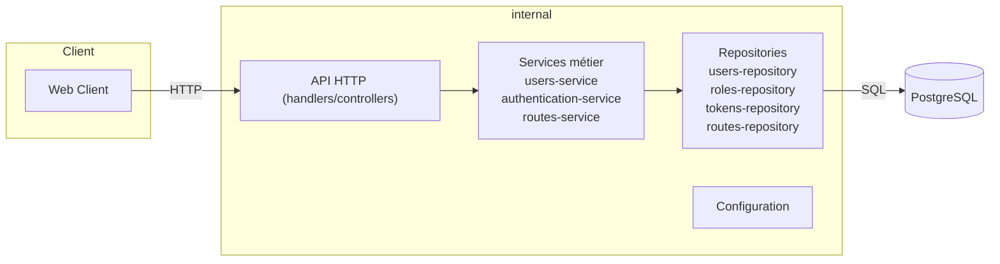

# supmap-users

Microservice de gestion des données utilisateurs pour Supmap

## Présentation

**supmap-users** est un microservice écrit en Go destiné à fournir l'ensemble des fonctionnalités directement liées à un utilisateur.
Il intègre une gestion de compte complète et d'authentification. 
Ce service est complètement stateless et peut être déployé selon une scalabilité verticale à condition de fournir les mêmes paramètres d'environnement.

Différents endpoints sont exposés :
- Authentification (Register, Login, Refresh etc...)
- Modification du compte
- Gestion des itinéraires

Certaines routes sont publiques, d'autres nécessitent une authentification et d'autres sont réservés aux utilisateurs authentifiés comme administrateur.

## Architecture

Ce service implémente une architecture par couche avec des controllers (handlers), des services et des repositories.



```
supmap-users/
├── cmd/api/             # Point d'entrée du microservice (main.go)
├── internal/
│   ├── api/             # Endpoints HTTP, server, handlers
│   ├── config/          # Chargement de la configuration
│   ├── models/          # Entités Bun
│   └── repository/      # Repository faisant le lien entre le service et la base de données
│   └── services/        # Services permettant de gérer les règles métier
├── Dockerfile           # Image Docker du microservice
├── go.mod / go.sum      # Dépendances Go
└── README.md
```

## Prérequis et installation

- Go 1.24
- Base de données postgres (conteneurisée ou non)

### Démarrage rapide 

```sh
# Cloner le repo
git clone https://github.com/4PROJ-Le-projet-d-une-vie/supmap-users.git
cd supmap-users

# Démarrer le service (nécessite les variables d'environnement, voir ci-dessous)
go run ./cmd/api
```

### Avec Docker

```sh
docker pull ghcr.io/4proj-le-projet-d-une-vie/supmap-users:latest
docker run --env-file .env -p 8080:80 supmap-users
```

#### Authentification

Pour pull l'image, il faut être authentifié par docker login.

- Générer un Personal Access Token sur GitHub :
    - Se rendre sur https://github.com/settings/tokens
    - Cliquer sur "Generate new token"
    - Cocher au minimum la permission read:packages
    - Copier le token
- Connecter Docker à GHCR avec le token :

```sh
echo 'YOUR_GITHUB_TOKEN' | docker login ghcr.io -u YOUR_GITHUB_USERNAME --password-stdin
```

## Configuration

La configuration se fait via des variables d'environnement ou un fichier `.env` :

|   Variable   | Description                                                                          |
|:------------:|:-------------------------------------------------------------------------------------|
|    `ENV`     | Définit l'environnement dans lequel est exécuté le programme (par défaut production) |
|   `DB_URL`   | URL complète vers la base de donnée                                                  |
|    `PORT`    | Port sur lequel écoutera le service pour recevoir les requêtes                       |
| `JWT_SECRET` | Secret permettant de vérifier l'authenticité d'un token JWT pour l'authentification  |

## Swagger

Chaque handler de ce service comprend des commentaires [Swaggo](https://github.com/swaggo/swag) pour créer dynamiquement une page Swagger-ui.
Exécutez les commande suivantes pour générer la documentation :
```sh
# Installez l'interpréteur de commande Swag
go install github.com/swaggo/swag/cmd/swag@latest

# Générez la documentation
swag init -g cmd/api/main.go
```

Maintenant, vous pouvez accèder à l'URL http://localhost:8080/swagger/index.html décrivant la structure attendue pour chaque endpoint de l'application

> **NB:** La documentation n'inclut pas les endpoints /internal destinés à une utilisation exclusivement interne